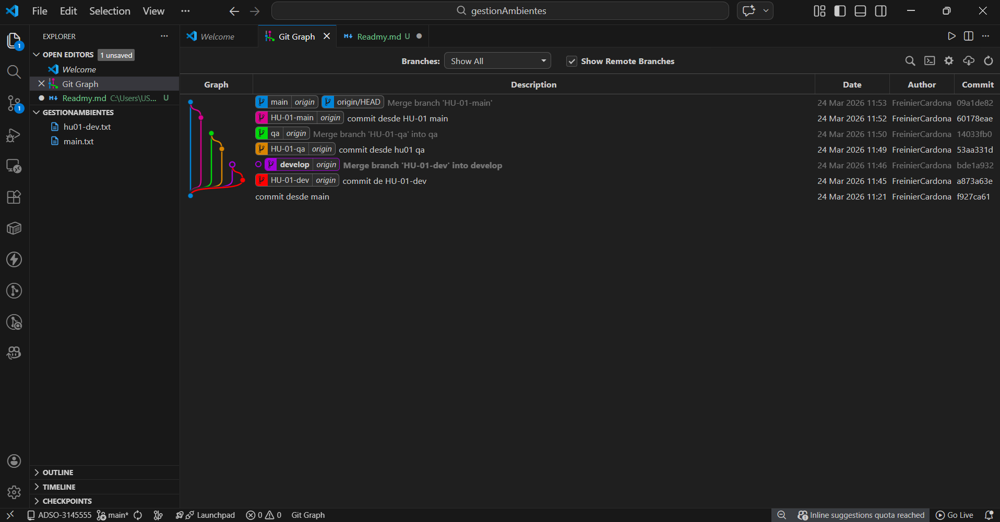

**Nombre:** Freinier Steven  
**Apellido:** Cardona  Perez
**Ficha:** 3145555  

---

# Descripción de la Actividad – Git Flow por Ambientes

## Objetivo
El objetivo de esta actividad es aprender a manejar correctamente las ramas en Git utilizando un flujo de trabajo por ambientes, con el fin de mantener un repositorio organizado y fácil de entender visualmente en Git Graph.

## Flujo de Ramas Utilizado
En este proyecto se utilizó un flujo de trabajo basado en ambientes, compuesto por las siguientes ramas principales:

- **main:** Rama principal que contiene el código en producción.
- **develop:** Rama de desarrollo donde se integran las nuevas funcionalidades.
- **qa:** Rama de pruebas donde se valida el funcionamiento antes de pasar a producción.

A partir de las ramas **develop** y **qa**, se crean ramas por cada Historia de Usuario (HU), por ejemplo:

- HU-01-develop
- HU-01-qa

Esto permite que cada historia de usuario tenga su propio flujo de desarrollo y pruebas sin afectar directamente las ramas principales.

## Proceso de Trabajo
El proceso que se siguió fue el siguiente:

1. Se crea la rama **main**.
2. A partir de **main** se crean las ramas **develop** y **qa**.
3. A partir de **develop** se crean las ramas de historias de usuario (HU-XX-develop).
4. Cuando una HU termina en develop, se hace merge hacia **develop**.
5. Luego se crea la rama **HU-XX-qa** desde **qa** para pruebas.
6. Después de las pruebas, se hace merge hacia **qa**.
7. Finalmente, cuando todo está correcto, se hace merge hacia **main**.

Este flujo permite tener control por ambientes (desarrollo, pruebas y producción) y mantener un historial de cambios organizado.

## Enlace del Repositorio
Repositorio del proyecto:

**GitHub:** https://github.com/FreinierCardona/gestionAmbientes.git

---
